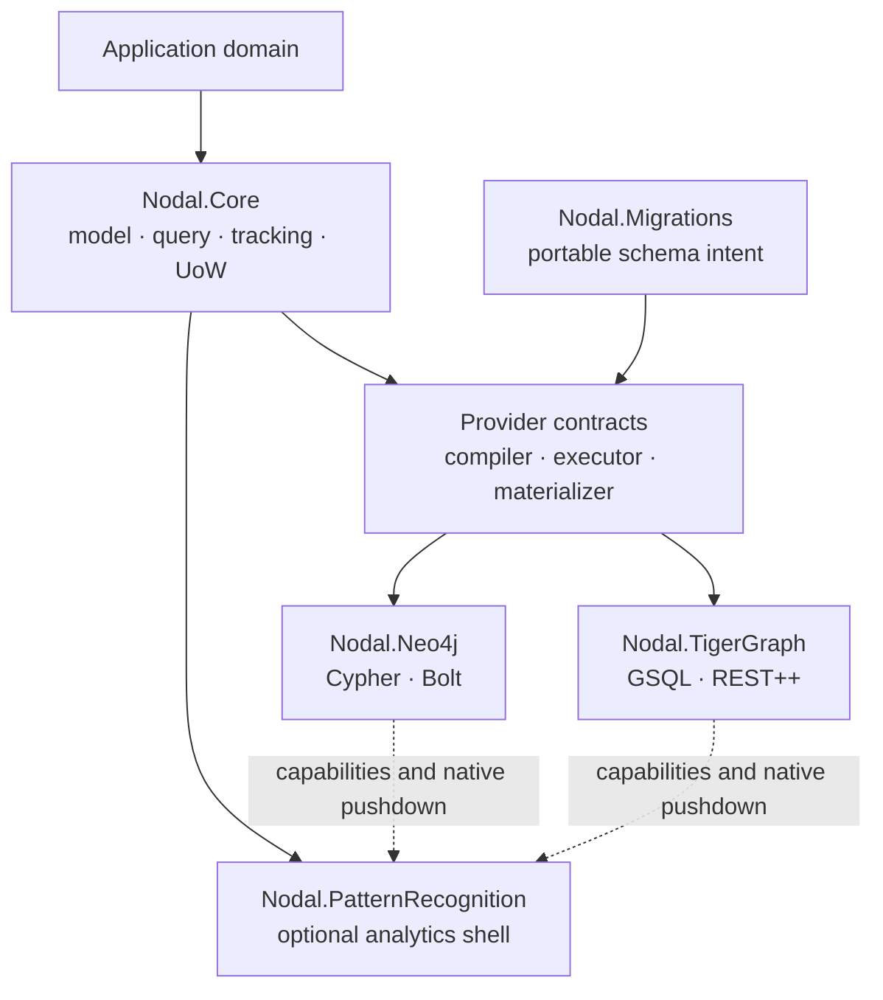

# Architecture

`Nodal.Core` does not depend on provider packages. Provider packages depend inward on stable contracts. `Nodal.Migrations` describes schema intent while provider dialects decide how it becomes native operations.

The execution pipeline is:

1. Build a provider-neutral query or mutation model.
2. Validate requested semantics against provider capabilities.
3. Compile parameterized native commands.
4. Execute using the provider's transport and transaction model.
5. Normalize native records into canonical graph results.
6. Materialize and optionally track domain POCOs.

This separation keeps native performance opportunities without making the domain depend on Cypher, GSQL, Bolt, or REST response shapes.

## The analytics shell

`Nodal.PatternRecognition` is an optional layer above the provider boundary,
not a provider and not a dependency of provider packages. It consumes canonical
graph paths and change events, builds typed feature representations, compares
paths, discovers communities and temporal transitions, and returns versioned
evidence that applications can explain or persist explicitly.

The shell may ask a provider to push down extraction, filtering, or a native
algorithm when its versioned capability declaration guarantees compatible
semantics. The portable .NET kernel completes the remaining stages. A provider
without a native accelerator therefore remains correct; it may differ only in
execution cost and documented limits.
