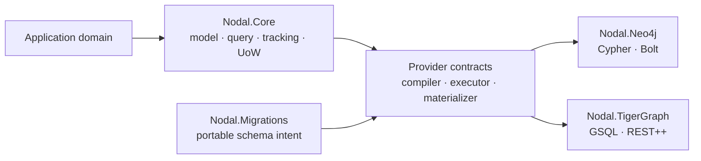

# Architecture

`Nodal.Core` does not depend on provider packages. Provider packages depend inward on stable contracts. `Nodal.Migrations` describes schema intent while provider dialects decide how it becomes native operations.

The execution pipeline is:

1. Build a provider-neutral query or mutation model.
2. Validate requested semantics against provider capabilities.
3. Compile parameterized native commands.
4. Execute using the provider's transport and transaction model.
5. Normalize native records into canonical graph results.
6. Materialize and optionally track domain POCOs.

This separation keeps native performance opportunities without making the domain depend on Cypher, GSQL, Bolt, or REST response shapes.
